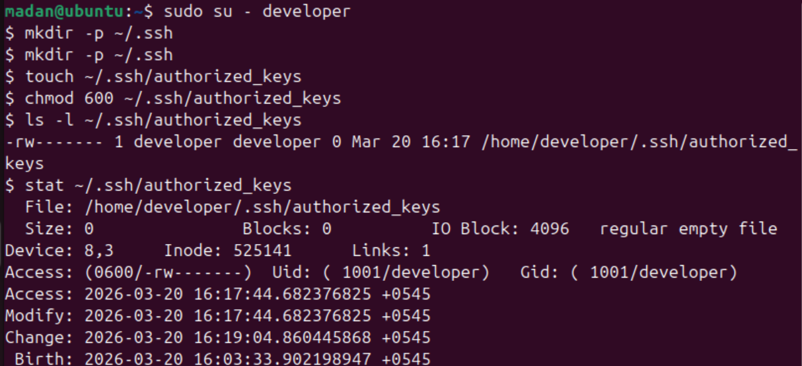
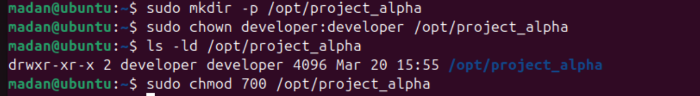
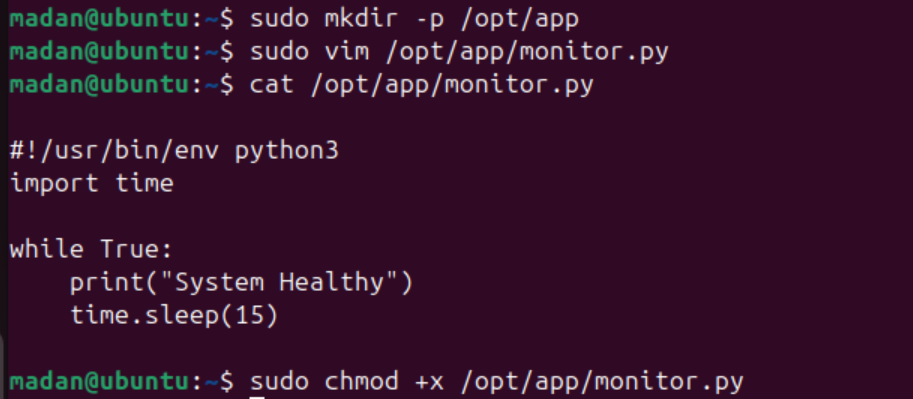
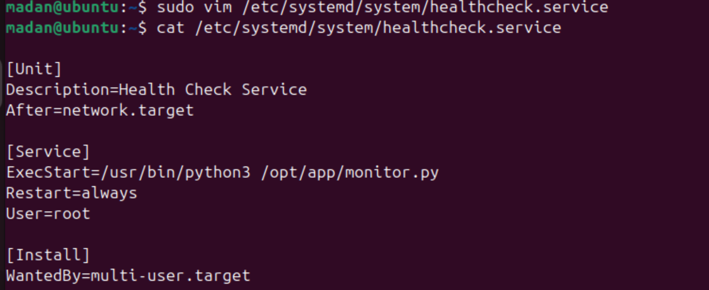
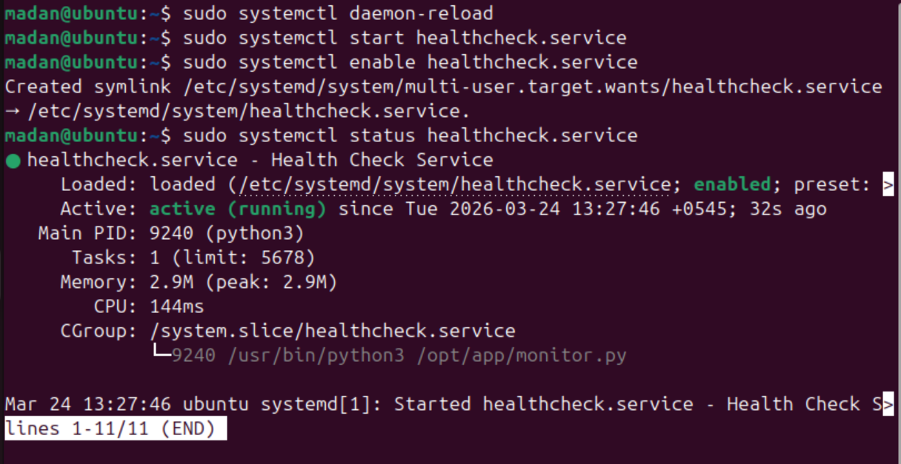
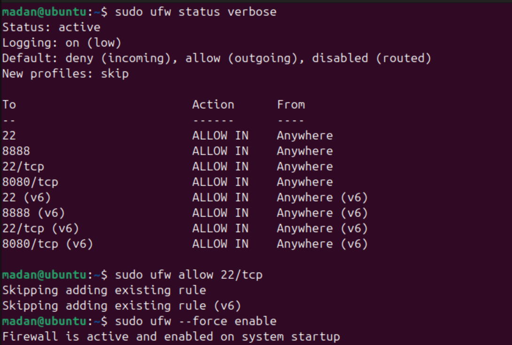
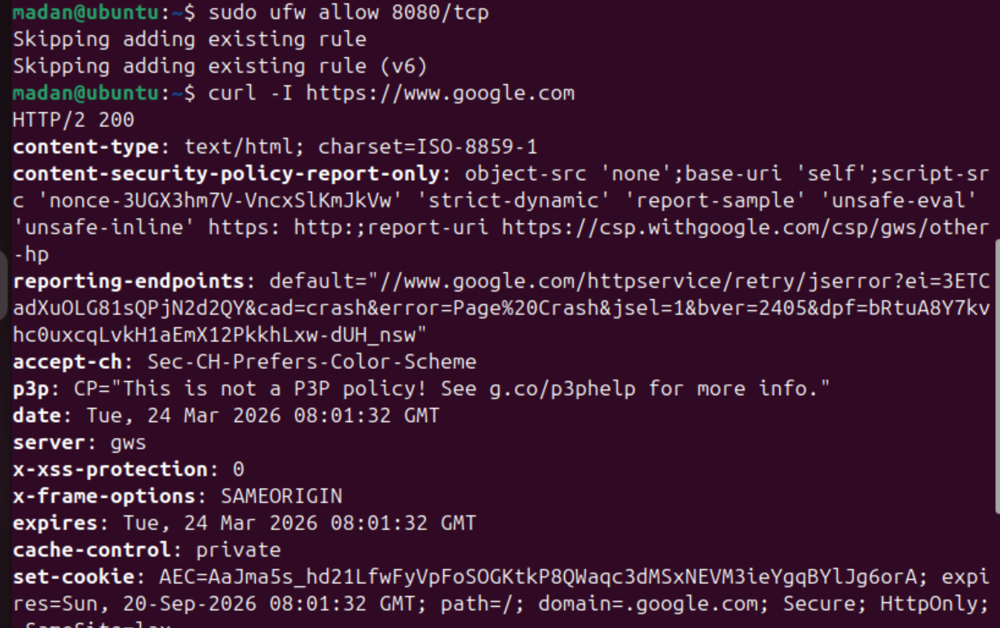
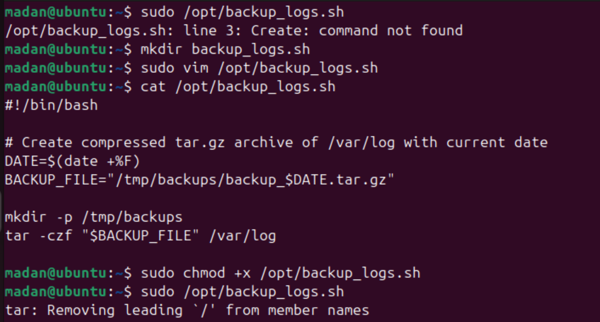
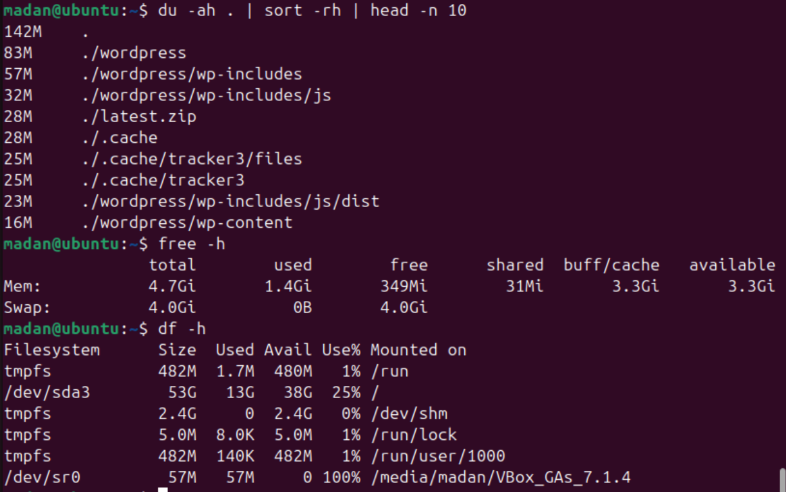

# Linux DevOps Tasks Repository

A complete set of Linux DevOps automations and documentation for 5 tasks. This file includes a summary and task-specific screenshot references that match each task README.

---

## 📋 Tasks Overview

### 1. Developer Onboarding
- Creates `developer` user
- Creates `/opt/project_alpha` and sets permissions
- Adds SSH key login for developer

**Task files**: `task-1-onboarding/command.sh`, `task-1-onboarding/README.md`

#### Screenshots
- 
- 

---

### 2. The Service Guardian
- Creates `/opt/app/monitor.py`
- Creates, enables, and starts `healthcheck.service`
- Verifies systemd status and logs

**Task files**: `task-2-The_Service_Guardian/Commands.sh`, `task-2-The_Service_Guardian/README.md`

#### Screenshots
- 
- 
- 

---

### 3. Firewall and Web Security
- Configures UFW rules for SSH and web ports
- Enables firewall and tests connectivity

**Task files**: `task-3-Firewall_and_Web_Securty/command.sh`, `task-3-Firewall_and_Web_Securty/README.MD`

#### Screenshots
- 
- 

---

### 4. Backup Automator
- Automates `/var/log` backups with date-stamped tarballs

**Task files**: `task-4-Backup_Automator/command.sh`, `task-4-Backup_Automator/README.md`

#### Screenshots
- 

---

### 5. Resource Investigator
- Shows CPU, memory, disk, and process metrics

**Task files**: `task-5-Resource_Investigator/command.sh`, `task-5-Resource_Investigator/README.md`

#### Screenshots
- 

---

## 🚀 Quick Start

1. `cd task-1-onboarding && sudo bash command.sh`
2. `cd task-2-The_Service_Guardian && sudo bash Commands.sh`
3. `cd task-3-Firewall_and_Web_Securty && sudo bash command.sh`
4. `cd task-4-Backup_Automator && sudo bash command.sh`
5. `cd task-5-Resource_Investigator && bash command.sh`

---

## 📝 Notes
- This README is the official root documentation and includes screenshot references.
- No additional changes are needed if this file is kept as-is.

